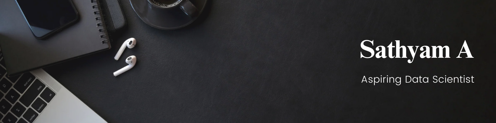

<h2 align="center">
  
</h2>

<h2 align="center">🌟 About Me:</h2>

I'm <b>Sathyam</b>, a third-year student at Indian Institute of Information Technology Sri City, a passionate Data Science📈 and AI/ML🔍 enthusiast with a knack for exploring the endless possibilities of data. I can play with data all day 🕺

  

  
  

  
  

  💼 Check out my portfolio website here: <a href="https://isathyam31.github.io/Portfolio/">Website</a> 
  📝 View my resume: <a href="https://drive.google.com/drive/folders/1IVEE0mrl-3T8zDbbu7tba_pPjY_Zexua?usp=sharing">Here</a> 
  💬 You can ask me about <b>Data Science and AI/ML</b>.

---

<h2 align="center">💬 Connect with me:</h2>

  
  

<h2 align="center">👨‍💻 Tech Stack:</h2>

  
  
  
  
  
  
  
  
  
   
  <a href="https://www.tableau.com/" target="_blank" rel="noreferrer">       
<a href="https://flask.palletsprojects.com/en/3.0.x/ target="_blank" rel="noreferrer"> 

<h2 align="center">📊 GitHub Stats:</h2>

  
  
  

<h2 align="center">🏆 GitHub Trophies:</h2>

  

