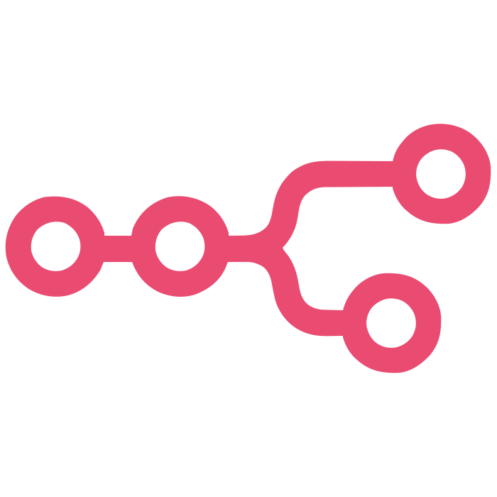

  

<h1 align="center">
  
</h1>

<h2 align="center">🌟 About Me</h2>

  

I'm <b>Sathyam</b>, a third-year student at <b>Indian Institute of Information Technology Sri City</b>. I'm passionate about Data Science 📈 and AI/ML 🔍 with a knack for exploring the endless possibilities of data. I can play with data all day! 🕺

  

  

  
🌐 **Portfolio:** [syth-portfolio.vercel.app](https://syth-portfolio.vercel.app/) | 📄 **Resume:** [View Here](https://drive.google.com/drive/folders/1IVEE0mrl-3T8zDbbu7tba_pPjY_Zexua?usp=sharing)

💬 **Ask me about:** Data Science, Machine Learning, AI, and Analytics!

 

## 🤝 Connect with Me

  

## 🛠️ Tech Stack & Tools

  
  
  
  
  
  
  
  
  
  
  
  
  
  
  
  
  
  
  
  
  
  
  
  
  
  
  
  
  

## 📊 Detailed GitHub Metrics

## 🏆 GitHub Achievements

  

## 📈 Contribution Graph

  

## 💡 Random Dev Quote

  

---

  
### 🌟 "Data is the new oil, but like oil, it's valuable only when refined!" 🌟

**Thanks for visiting my profile! Let's connect and build something amazing together! 🚀**

